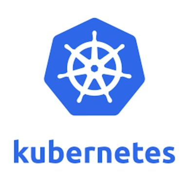
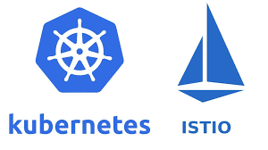

## Introduction to Knative


Georgi Bozhinov, SAP, 2018
---

### Knative is an open-source platform for deploying serverless workloads on




---

- Provides a set of high-level key components that manage and automate the different aspects of deploying an application
- From source to url to the cloud, on premise or on a third-party data center.
- Functions, applications, containers

---

### But first...

#### What is serverless?

- Run code without provisioning or managing servers
- The platform handles everything down to resource provisioning and managing processes
- Functions as a service (FaaS)
- Message-driven, microservice applications

---

### What is FaaS?

- Upload the code only, no application
- Functions act as microservices in the architecture of the application
- Run backend code without managing own server systems and long-lived apps
- Example: Responses to requests from client apps

---

### So how does Knative achieve this architecture?

---

### Knative components

- Build - source-to-container build orchestration
- Eventing - management and delivery of events
- Serving - request-driven scaling, network programming, point-in-time snapshots of deployed code and configurations

---

### Knative components

* Build

---

### Build

* A build is a resource in Knative to fetch, build and package code on-cluster.
* Defined in a single config file
* Build templates ( Kaniko, cf buildpack template ) - reusable build pipelines
* Example: Fetch code from github, use docker image to build it and deploy it on-cluster

---

### Build

```
apiVersion: build.knative.dev/v1alpha1
kind: Build
metadata:
  name: hello-build
spec:
  steps:
  - name: hello
    image: busybox
    args: ['echo', 'hello', 'build']
```

[Samples](https://github.com/knative/build/tree/master/test)

---

### Knative components

* Serving

---

### Serving

Builds on K8S and Istio to support deploying and serving of serverless apps and functions



---

### Serving

Features:

* Rapid deployment of serverless containers
* Autoscaling up and down
* Network programming - routing, ingress, services, load balancing for distributed microservices
* Point-in-time snapshots of deployed code ( called Revisions )

---

### Serving


---

### Serving - Service

* Knative serving gives us a Service abstraction
* Not to be confused with all the other meanings of service in this context
* Manages lifecycle of the workload. Creates objects to ensure app has route, a configuration and a new revision on each update.

---

### Serving - Route

* Maps a network endpoint to one of more revisions.

---

### Serving - Configuration

* Maintains the desired state for the deployment. Modifying it creates a new revision.

---

### Serving - Revision

* Point-in-time snapshot of the code. Linear history for each new modification. Revisions are immutable.

---

### Build + Serving

An end-to-end deployment from source

### DEMO

---

### Build + Serving

What Knative did:

* Fetched the source from github and built the docker image with the build template
* Uploaded it to the registry 
* Created an immutable revision of the app
* Network programming - route, ingress, service (k8s service) and load balancer
* Will automatically scale the pods up and down

---

### Autoscaling

Speaking of...
Autoscaling a golang web service

### DEMO

---

### Knative Components

* Eventing

---

### Eventing

* Managing event sources, responding to events, connecting services through message buses
* Main components are Buses, Sources, and Flows

---

### Eventing - Buses

* Provide a k8s native abstraction over message buses like Kafka
* Events published to a Channel, Subscriptions route that Channel to interested applications

---

### Eventing - Sources

* Abstraction for data sources outside k8s and routing them to the cluster
* Examples: Kubernetes Events, Github Events, GCP PubSub

---

### Eventing - Flows

* Describes the desired path from an external Source of events to a destination that will react to the events.

---

### Recap

Main features of Knative:

* Autoscaling
* Source-to-url deployment
* Networking is handled for us
* We write the code, the platform does the rest
* Serverless

---

## Thank you for the attention!


